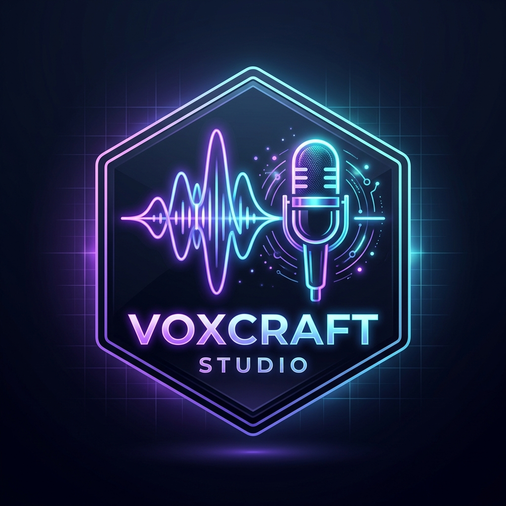

# 🎙️ VoxCraft Studio — Offline Neural TTS & Podcast Desktop Studio

<div align="center">



### **Production-Grade, 100% Offline Multi-Engine Text-to-Speech & Podcast Studio for Windows**

[](https://www.python.org/)
[](https://www.qt.io/)
[](https://onnxruntime.ai/)
[](https://github.com/)
[](LICENSE)

**Developed by Shahid**

</div>

---

## 🌟 Highlights

**VoxCraft Studio** brings studio-grade neural speech synthesis directly to your Windows desktop. Designed for privacy, speed, and creative freedom, VoxCraft Studio operates **100% locally with zero cloud latency and no internet connection required**.

### ⚡ 3 Integrated Offline Neural Speech Engines:
1. **Engine 1 (Kokoro-82M ONNX)**:
   - Ultra-fast 24kHz studio-quality voice generation.
   - Dual-Voice Blending vector matrix (mix two distinct voice styles with customizable blend ratios).
2. **Engine 2 (Piper Neural Multi-Lingual)**:
   - Extremely lightweight, low-latency CPU speech synthesis.
   - Multi-lingual neural models: English, British English, Spanish, French, German, Italian, Portuguese, and more.
3. **Engine 3 (F5-TTS Flow Matching Diffusion)**:
   - Zero-shot neural voice cloning from short 5–15s reference audio samples.
   - Built-in studio presets for narration and broadcast speech.

---

## 🚀 Key Features

- 🔒 **100% Offline Privacy**: Zero telemetry, zero cloud APIs, zero subscription fees.
- 📁 **Automated Per-Conversion Export Folders**: As soon as speech processing completes, audio, full text, and narration timestamps are saved into a dedicated folder named with the first few words of the text + timestamp (e.g. `exports/A_desperate_tribe_of_Glimmer-Foxes_2026-09-08_08-49-35/`).
- ⏱️ **Exact Word-Level & Millisecond-Level Narration Timestamps**: Outputs precise word-level timing JSON files matching video synchronization standards.
- ⚡ **Intelligent Acceleration**: Automatic hardware detection for **NVIDIA CUDA** and **Windows DirectML**, with optimized multi-threaded CPU fallback.
- 📻 **Podcast Studio**: Multi-speaker conversation writer (Host, Guest, Narrator) with per-speaker voice, rate, pitch, and volume controls.
- 📦 **Batch File Narration**: Queue multiple text files (`.txt`, `.md`) for bulk speech conversion with real-time status tracking.
- 🎭 **Voice Library Explorer**: Browse and search voice models with instant audio sample previews.
- 🌐 **Multi-Language Selector**: Filter voices and languages with a single click.
- 📦 **In-App Model Hub**: Download and manage additional international language packages directly inside the desktop app.
- 🎛️ **Live Audio HUD**: Waveform playback bar with seekable scrubber, volume slider, playback speed controls, and WAV/MP3 export.

---

## 📂 Export Folder & Narration Timestamp Structure

Every time you generate speech, VoxCraft Studio automatically creates a dedicated folder in `exports/` containing:

```
exports/A_desperate_tribe_of_Glimmer-Foxes_2026-09-08_08-49-35/
├── A_desperate_tribe_of_Glimmer-Foxes_2026-09-08_08-49-35.wav      # Studio-quality synthesized audio
├── A_desperate_tribe_of_Glimmer-Foxes_2026-09-08_08-49-35.txt      # Full original text input
├── A_desperate_tribe_of_Glimmer-Foxes_2026-09-08_08-49-35.json     # Exact word-level narration timestamps
├── A_desperate_tribe_of_Glimmer-Foxes_2026-09-08_08-49-35.srt      # SubRip subtitle file for video editors
└── A_desperate_tribe_of_Glimmer-Foxes_2026-09-08_08-49-35.vtt      # WebVTT subtitle file
```

### Narration Timestamp JSON Format:
```json
{
  "text": "A desperate tribe of Glimmer-Foxes, their fur dulled by the blight that consumed their ancient forests...",
  "duration_seconds": 95.99,
  "words": [
    {
      "word": "A",
      "start": 0.08,
      "end": 0.22
    },
    {
      "word": "desperate",
      "start": 0.32,
      "end": 0.82
    },
    {
      "word": "tribe",
      "start": 0.92,
      "end": 1.212
    },
    {
      "word": "of",
      "start": 1.312,
      "end": 1.476
    },
    {
      "word": "Glimmer-Foxes,",
      "start": 1.576,
      "end": 2.148
    }
  ]
}
```

---

## 🛠️ Quick Start

### Prerequisites
- **Operating System**: Windows 10 / 11 (64-bit)
- **Python**: Python 3.10, 3.11, or 3.12 ([Download from python.org](https://www.python.org/downloads/))  
  *(Make sure to check "Add Python to PATH" during installation)*

### 1. Clone the Repository
```bash
git clone https://github.com/mianshahid-official/voxcraft-studio.git
cd voxcraft-studio
```

### 2. Install Dependencies (1-Click Installer)
Double-click `install.bat` or run:
```bash
# Windows Command Prompt / PowerShell
install.bat
```
Or install via pip manually:
```bash
pip install -r requirements.txt
```

### 3. Launch Application
Double-click `run.bat` or run:
```bash
# Option A: 1-Click launcher
run.bat

# Option B: Python entrypoint
python run.py

# Option C: Web Studio mode (browser interface)
python run.py --web
```

---

## 📦 First-Run Setup & Model Downloader Wizard

When you first launch VoxCraft Studio, the built-in **Setup Wizard** automatically:
1. Performs hardware diagnostics (CPU cores, RAM, GPU/DirectML support).
2. Lets you choose your neural models (Kokoro-82M, Piper Multi-Lingual, F5-TTS).
3. Downloads and verifies model weights with SHA256 integrity checksums.
4. Synthesizes a test audio sample to verify your offline audio pipeline.

To run the Setup Wizard manually at any time:
```bash
python run.py --wizard
```

---

## 📂 Project Structure

```
voxcraft-studio/
├── app/
│   ├── backend/              # Local ASGI server & REST/WebSocket bridge
│   ├── config/               # Settings, paths, and download manifests
│   ├── core/                 # Audio DSP, chunking, timestamps, hardware detection
│   ├── engines/              # Engine implementations (Kokoro, Piper, F5-TTS)
│   ├── frontend/             # Optional Web Studio frontend assets
│   ├── gui/
│   │   ├── views/            # PySide6 Studio views (TTS, Podcast, Batch, Voice Library, etc.)
│   │   ├── widgets/          # Glassmorphism cards, sliders, audio player HUD
│   │   ├── wizard/           # Setup & Model Installer Wizard
│   │   └── theme.py          # Dark Studio glassmorphism design system
│   ├── resources/            # App icons and graphics
│   ├── services/             # TTS synthesis, podcast assembly, storage & cache
│   ├── voices/               # Local voice catalog & language registry
│   └── main.py               # Main application launcher
├── data/
│   └── reference_voices/     # Reference audio for voice cloning
├── models/                   # Local offline neural model weights (downloaded via wizard)
├── exports/                  # Auto-generated per-conversion export folders
├── installer/                # Automated installer & environment wizard
├── tests/                    # Pipeline verification test suite
├── .gitignore                # Excludes large binaries, exports, and caches
├── install.bat               # 1-Click Windows installer
├── run.bat                   # 1-Click Windows launcher
├── run.py                    # Root launcher entrypoint
├── requirements.txt          # Python dependencies
└── README.md                 # Complete documentation
```

---

## 🧪 Running Automated Tests

Run the test suite to verify offline neural synthesis, chunking, audio DSP, and UI instantiation:
```bash
python tests/test_engines.py
python tests/test_pyside_pipeline.py
```

---

## 📜 License

Distributed under the **MIT License**. See `LICENSE` for more information.

---

<div align="center">

**VoxCraft Studio** • Developed with ❤️ by **Shahid**

</div>
